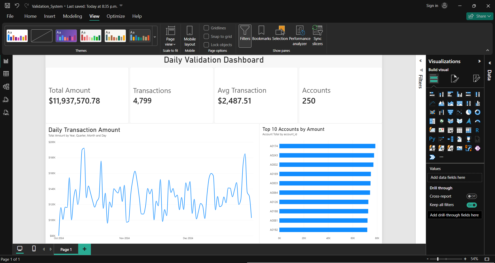
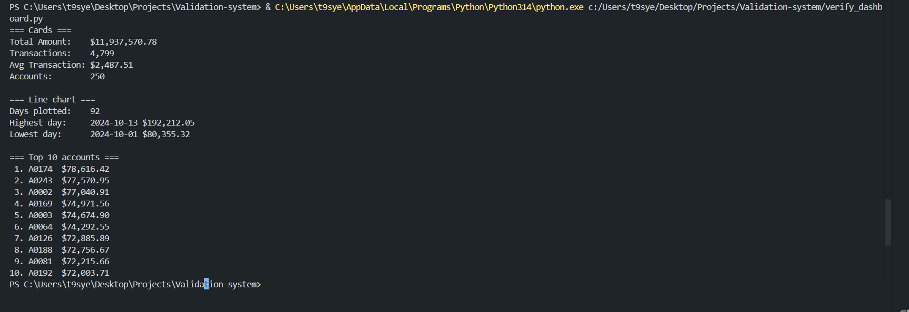

# Automated Reporting Quality Assurance & Validation System

## Overview

A self-initiated **Quality Engineering** project that simulates a **banking-style reporting pipeline** and validates reporting accuracy **end-to-end** using SQL, Python automation, and reconciliation checks.

---

## Architecture

```
generate_transactions.py  (synthetic 5,000+ row dataset)
  → transactions.csv
  → transactions_raw        (SQLite staging table)
  → transactions_validated  (SQL view: removes duplicates and invalid amounts)
  → daily_summary / account_summary  (reporting tables)
  → CSV reports             (ready for Power BI or other BI tools)
  → Power BI dashboard      (checked against the database by verify_dashboard.py)
```

---

## Pipeline

0. **Generate** a synthetic dataset (`generate_transactions.py`): 5,000 unique transactions across 250 accounts and 92 days, with about 2% missing amounts, 2% negative amounts and 1% duplicate rows added on purpose. It uses a fixed seed, so every run produces the same file.
1. **Ingest** raw transactions (CSV → SQLite staging table `transactions_raw`) with a bulk insert. Amounts are stored as **integer cents**. Missing amounts are stored as `NULL`, not `0`, so they can be detected later.
2. **Validate:** create the `transactions_validated` view, which keeps one row per `transaction_id` and removes rows with `NULL` or negative amounts.
3. **Report:** build two summary tables from the validated data:
   - `daily_summary`: transaction count and total amount by date
   - `account_summary`: transaction count and total amount by account
4. **Export** both reports to CSV for downstream use.
5. **Reconcile:** check that the report totals match the validated source data.
6. **Visualize & verify:** build a Power BI dashboard on the data, then run `verify_dashboard.py` to print the numbers each visual should show, calculated straight from `transactions_validated`.

---

## QA Checks Implemented

### Data Quality
- **Completeness:** row counts after ingestion (`verify_db.py`) and raw vs. validated counts (`create_validated_view.py`)
- **Validity:** `NULL` and negative amounts are filtered out of the validated layer
- **Integrity:** duplicate `transaction_id`s are detected and removed

### Reporting Accuracy (Reconciliation)
| ID | Check | Script |
|----|-------|--------|
| REC-001 | Total amount: validated source vs. `daily_summary` | `reconcile_totals.py` |
| REC-002 | Transaction count: validated source vs. `daily_summary` | `reconcile_totals.py` |
| REC-003 | Count and total per date | `reconcile_by_date.py` |
| REC-004 | Count and total per account | `reconcile_by_account.py` |

### Export Accuracy
- Row counts **and amount totals** in each exported CSV match the database tables (`verify_exports.py`)

### Dashboard Accuracy
`verify_dashboard.py` prints the expected value for every visual on the Power BI dashboard, so each one can be checked by hand:
- **Cards:** total amount, transaction count, average transaction and distinct accounts
- **Line chart:** number of days plotted, plus the highest and lowest day
- **Bar chart:** the top 10 accounts by total amount, in order

### Automation & Scale
- Every check script exits with code `1` on FAIL, so `run_pipeline.py` stops at the first failing step.
- Date and account reconciliations print only mismatches plus a summary line, so the output stays readable with thousands of rows.

---

## Validation Results

On the generated dataset (5,050 raw rows → 4,799 validated rows; 50 duplicate IDs, 99 missing and 102 negative amounts among the unique transactions):

- ✅ REC-001 / REC-002: Overall totals and counts: PASS
- ✅ REC-003: By date (92 dates): PASS
- ✅ REC-004: By account (250 accounts): PASS
- ✅ Export row counts and totals: PASS

- ✅ Power BI dashboard matches `verify_dashboard.py`: PASS

The full pipeline runs in under 1 second. To check that failures are caught, change one account's total by 1 cent: REC-004 reports FAIL for that account.

---

## Dashboard Verification

The Power BI dashboard built on the validated data:



The expected values from `verify_dashboard.py`:



Every visual matches the script:

| Visual | Expected (`verify_dashboard.py`) | Dashboard |
|--------|----------------------------------|-----------|
| Total Amount | $11,937,570.78 | $11,937,570.78 ✅ |
| Transactions | 4,799 | 4,799 ✅ |
| Avg Transaction | $2,487.51 | $2,487.51 ✅ |
| Accounts | 250 | 250 ✅ |
| Line chart | 92 days, peak 2024-10-13 ($192,212.05), low 2024-10-01 ($80,355.32) | Oct–Dec 2024, peak ≈ $192K, low ≈ $80K ✅ |
| Top 10 accounts | A0174, A0243, A0002, A0169, A0003, A0064, A0126, A0188, A0081, A0192 | Same accounts, same order ✅ |

---

## Fixed Issues

- **Duplicate rows were not removed.** The validated view now keeps one row per `transaction_id`, and a check prints any duplicate IDs found in the raw data.
- **Re-running `create_db.py` duplicated every row.** It now drops, recreates and reloads `transactions_raw` from `transactions.csv` on each run.
- **Floating-point amounts were compared with `==`.** Summing thousands of floats in a different order causes small rounding differences, which made reconciliation fail at scale. Amounts are now stored and reconciled as integer cents, so totals match exactly at any volume. Reports are exported as 2-decimal amounts.

---

## Known Limitations

- **Negative amounts are treated as invalid.** This is a business rule chosen for this dataset. In a real bank, negatives could be valid withdrawals or refunds, so this rule would be confirmed with the business team.

---

## Tech Stack

- **Python 3**, standard library only (`sqlite3`, `csv`, `decimal`); no packages to install
- **SQL**
- **SQLite**
- **CSV-based reporting**
- **Power BI** (dashboard)

---

## What I Learned

How to design QA checks for a reporting pipeline, how to use reconciliation to prove reports are correct across several dimensions, and why reconciliation alone is not enough. Checks on the source data (like duplicate detection) are also needed.

---

## How to Run

```bash
python generate_transactions.py   # optional: --rows 20000 --accounts 500 --seed 7
python run_pipeline.py
```

Or run each step by hand:

```bash
python create_db.py
python verify_db.py
python create_validated_view.py
python create_daily_summary.py
python create_account_summary.py
python export_reports.py
python verify_exports.py
python reconcile_totals.py
python reconcile_by_date.py
python reconcile_by_account.py
```

To check the Power BI dashboard, run the script below and compare each line with the matching visual:

```bash
python verify_dashboard.py
```

Every step rebuilds its own table or view, so you can re-run the pipeline without deleting `banking_qa.db` first.
